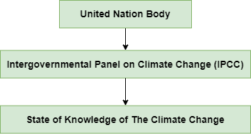
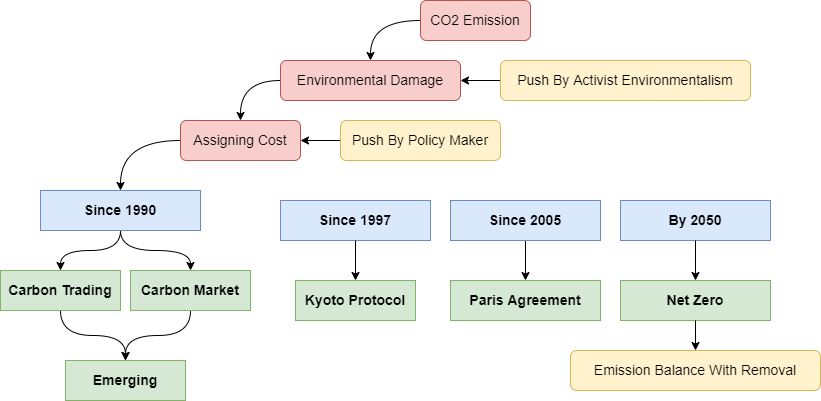
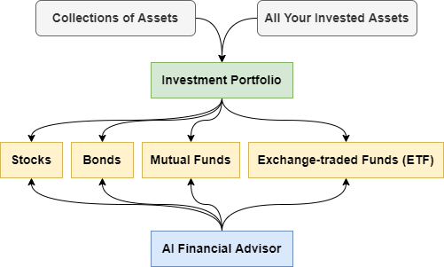

# The Carbon Credit Course

# Table of Contents

- Carbon Information Resources
- List Reading
- IPCC
- Carbon Market
  - Compliance Market

- Carbon Credit
  - Type of Carbon Credits
  - Carbon Credit Generation

- Carbon Offset
- Carbon Emitters
- Carbon Pricing
- Carbon Market Problem
- Solution

---

# Carbon Information Resources

Last Touched on 28 July 2022

| Parameter               | Value                                                        | Note |
| ----------------------- | ------------------------------------------------------------ | ---- |
| Carbon Stocks Watchlist | [Click Here](https://carboncredits.com/carbon-stocks-watchlist/) |      |
| GHG Protocol            | [Click Here](https://ghgprotocol.org/)                       |      |
|                         |                                                              |      |

Carbon offset credits (a/k/a “carbon offsets”, “carbon credits”). 

Every financial transaction has a climate consequence. Pretty much everything we buy has a carbon footprint. Our daily choices leave a carbon footprint. The average American generates 16 tons of CO2e a year through driving, shopping, using electricity and gas at home, and generally going through the motions of everyday life. 

Carbon credits are generated in both the compliance and voluntary markets.

Carbon-credit trading is set to hit $50 billion by 2030.

Carbon Credit Settlement Platform 

"Swift for the carbon markets"

Make high-quality carbon credits accessible to everyone.

---

# Read First

- Backing Good Carbon - [Click Here](https://medium.com/greenfield-one/backing-goodcarbon-tokenizing-nature-based-climate-solutions-to-close-funding-gap-create-forward-15750ecffc0b)

# List Reading 

- Carbon Credit Blockchain Startup
  - dclimate.medium.com

- What Are Carbon Credit? - [Click Here](https://www.conserve-energy-future.com/carbon-credits.php)
- Want To Understand Carbon Credits? Read This - [Click Here](https://www.forbes.com/sites/erikkobayashisolomon/2020/03/13/want-to-understand-carbon-credits-read-this/?sh=490e4feb71aa)
- How to buy carbon credits to offset your footprint - [Click Here](https://climatetrade.com/how-to-buy-carbon-credits-to-offset-your-footprint/)
- How to Make Money Producing & Selling Carbon Credits - [Click Here](https://carboncredits.com/how-to-make-money-producing-and-selling-carbon-offsets/)
- Net0 Carbon Credit - [Click Here](https://net0.com/blog/carbon-credits)
- The Ultimate Guide to Understanding Carbon Credits - [Click Here](https://carboncredits.com/the-ultimate-guide-to-understanding-carbon-credits/#6-1)
- What are Carbon Offset? - [Click Here](https://www.conserve-energy-future.com/what-are-carbon-offsets.php)
- How to Acquire Carbon Offset Credits - [Click Here](https://www.offsetguide.org/understanding-carbon-offsets/how-to-acquire-carbon-offset-credits/)
- What is The Role of Kyoto Protocol ? - [Click Here](https://www.conserve-energy-future.com/what-is-kyoto-protocol.php)
- What American Carbon Registry Do? - [Click Here](https://americancarbonregistry.org/how-it-works/what-we-do)
- The Greenhouse Gas Protocol - [Click Here](https://ghgprotocol.org/standards/project-protocol)
- Paper - Blockchain of Carbon Trading for UN Sustainable Development Goals - [Click Here](https://www.mdpi.com/2071-1050/12/10/4021/htm)
- Carbon Credit Registry
  - Marketplace Gold Standard, Bauminvest - [Click Here](https://marketplace.goldstandard.org/collections/projects/products/bauminvest-bauminvest-reforestation-project)
  - Registry Gold Standard, Bauminvest - [Click Here](https://registry.goldstandard.org/projects/details/1795)
- Visa
  - How Visa Makes Money - [Click Here](https://www.investopedia.com/how-visa-makes-money-4799098)
  - Crypto.com Card - [Click Here](https://crypto.com/cards)
  - Visa moves to allow payment settlements using cryptocurrency - [Click Here](https://www.reuters.com/business/autos-transportation/exclusive-visa-moves-allow-payment-settlements-using-cryptocurrency-2021-03-29/)
  - Visa Becomes First Major Payments Network to Settle Transactions in USD Coin (USDC) - [Click Here](https://usa.visa.com/about-visa/newsroom/press-releases.releaseId.17821.html) - [Click Here](https://www.businesswire.com/news/home/20210329005171/en/) - [Click Here](https://www.bloomberg.com/press-releases/2021-03-29/visa-becomes-first-major-payments-network-to-settle-transactions-in-usd-coin-usdc)
- Carbonplace
  - More banks join blockchain-based carbon marketplace - [Click Here](https://www.finextra.com/newsarticle/39694/more-banks-join-blockchain-based-carbon-marketplace)
  - Three banks join initiative for voluntary carbon market platform - [Click Here](https://www.reuters.com/business/sustainable-business/three-banks-join-initiative-voluntary-carbon-market-platform-2022-02-15/)
  - Banks launch carbon marketplace - [Click Here](https://www.finextra.com/newsarticle/38438/banks-launch-carbon-marketplace)
  - Carbonplace and Visa team on carbon credit transfer pilot - [Click Here](https://www.finextra.com/newsarticle/40205/carbonplace-and-visa-team-on-carbon-credit-transfer-pilot?utm_medium=rssfinextra&utm_source=finextrafeed)
  - Carbonplace links with Visa on carbon credit transfer trial - [Click Here](https://member.fintech.global/2022/05/10/carbonplace-links-with-visa-on-carbon-credit-transfer-trial/)
  - Carbonplace and Visa Team Up for Carbon Credit Transfer - [Click Here](https://www.prnewswire.com/news-releases/carbonplace-and-visa-team-up-for-carbon-credit-transfer-301542372.html)
  - Carbonplace, NAB and Visa Team Up for Carbon Credit Transfer - [Click Here](https://news.nab.com.au/news/carbonplace-transfer/)
  - BBVA joins global carbon credit transaction network, Carbonplace - [Click Here](https://www.bbva.com/en/sustainability/bbva-joins-global-carbon-credit-transaction-network-carbonplace/)
  - Carbonplace and Climate Impact X collaborate to revolutionize carbon credit - [Click Here](https://www.natwestgroup.com/news/2022/03/carbonplace-and-climate-impact-x-collaborate-to-revolutionize-carbon-credit-trading.html) 

---

# Watchlist

- [ICDX](https://www.icdx.co.id/our-market/carbon)
- [dclimate.net](https://www.dclimate.net/)
- Open Forest Protocol - [Click Here](https://www.openforestprotocol.org/validators)
- net0.com
- puro.earth
- [bluesource.com](https://www.bluesource.com/services/carbon-offset-project-development/)
- southpole.com
- goldstandard.org

---

# IPCC

During the past 100 years, global average surface temperature increased by about 0.7 degrees Celsius resulting in [climate change](https://en.wikipedia.org/wiki/Climate_change).

# Carbon Market

The carbon market is split in two : 

- The compliance side is driven by legislative obligations placed on businesses to reduce their carbon footprint. 
- The voluntary side grew out of demands from consumers that the companies they buy from operate in the most carbon-neutral way possible.

---

---

## Compliance Market

The compliance markets start with interactions between large institutions – industrial manufacturers and other enterprises.

Carbon trading – or the carbon market – was first developed and introduced in the 1990s. In assigning a cost to the environmental damage of CO2 emissions, companies could, in theory, track and offset their own emissions. By purchasing carbon credits tied to ‘green projects’ in the marketplace, businesses across a range of industries could continue their practices while offsetting emissions and therefore reducing environmental damage. 

For example, a mining company subjected to an emissions limit could purchase an offset credit owned by a forest owner who could agree to use that money to delay or reduce a harvest. This would then allow the mining company to pollute above their set limit, and use the avoided forest emissions as credit. 

---

# Carbon Credit

**A Carbon Credit is an allowance for a company holding the credit to emit carbon emissions or greenhouse gases.** A single credit equals one ton of carbon dioxide to be emitted. Companies hold many credits, as many as they wish to purchase to balance out their emissions.

---

## Type of Carbon Credits

There are two types of carbon credits:

1. **Voluntary emissions reduction (VER):** A carbon credit from an offsetting project that has a third-party certification standard such as the [Gold Standard](https://www.goldstandard.org/) and many others, but isn't certified by the UN schemes such as the Clean Development Mechanism (CDM). It is exchanged in the over-the-counter voluntary market for credits. This can't be used to achieve obligations under the Kyoto Protocol. VER projects are certified but are not traded through a central government system.
2. **Certified emissions reduction (CER):** A carbon credit that is backed by the UN and issues a permit for one unit (tonne) of carbon emissions. They are issued to UN member states for offsetting projects through the CDM, regulated by the Kyoto Protocol, which is an offset scheme that allows a member state to offset emissions in another country because internationally, it is offset in the atmosphere anyways. 

---

## Carbon Credit Generation

Carbon credits are generated in both the compliance and voluntary markets

Emission reduction projects reduce the amount of greenhouse gases in the atmosphere in one of three ways:

1. By capturing and destroying a greenhouse gas that would otherwise be emitted into the atmosphere. An example of this is a methane gas capture project at a landfill.
2. By producing energy using a clean, renewable resource that eliminates the need to produce that same energy from fossil fuels, the burning of which releases greenhouse gas into the atmosphere. An example of this is wind power.
3. By capturing and storing (or “sequestering”) greenhouse gases to prevent their release into the atmosphere. An example of this is a project that promotes the healthy growth and maintenance of forests.

Some projects include more than one of these activities at the same time. For example, gas capture projects at landfills not only prevent the release of methane gas into the atmosphere, but they also use the captured methane to generate electricity that would otherwise be generated by burning fossil fuels such as coal or natural gas.

---

# Carbon Offset

**Carbon Offset Programs** issue credits to projects that purport to avoid greenhouse gas emissions or remove carbon dioxide from the atmosphere. 

For example, an oil refinery that is subject to an emissions limit might purchase an **offset credit** issued to a forest owner who agrees to reduce or delay a timber harvest. The refinery can then pollute more, claiming the avoided forest emissions as compensation.

**Offset Credit** is the idea is to pay for emission reductions elsewhere rather than invest in the country of operation.

The money you pay to buy offsets supports programs designed to reduce emissions. Those might include projects to develop renewable energy, capture methane from landfills or livestock, or distribute cleaner cooking stoves.

Reforestation increases biodiversity, and the installation of solar panels and wind turbines pulls energy demand away from coal and fossil fuel supplies.

A **Carbon offset** is a **certificate representing the reduction** of one metric ton (2,205 lbs) of carbon dioxide emissions, the principal cause of climate change. **Carbon offsets** compensate for your emissions by canceling out greenhouse gas emissions somewhere else in the world.  **Carbon offsets** are purchased to fund green projects and diminish the impact of your own GHG emissions, even though the projects are located elsewhere. 

A carbon offset can be resold multiple times but once retired, it can no longer be resold. To ensure there is no double-sale, a carbon offset must be kept on a registry. This registry keeps track of the issuance and retirement of offsets.

There is no fixed price on carbon, and the cost of an offset varies from project to project, depending on how expensive it is to run a given program, said Sarah Leugers, director of communications at The Gold Standard. In general, though, carbon offsets probably cost less than you think.

If you develop a project that reduces carbon dioxide emissions, every ton of emissions reduced results in the creation of one carbon offset. Project developers can then sell these offsets to finance their projects. There are hundreds of different types of carbon reduction projects. For example, a dairy farm can install an anaerobic digester to capture and destroy methane that would otherwise be released when animal manure decomposes. However, such anaerobic digester projects are typically expensive to install and maintain. In order to finance the construction and operation of a digester project, a dairy farm can sell the emission reductions in the form of carbon offsets.

Carbon offsets are therefore an available tool for individuals and organizations that wish to mitigate the impact of their own carbon footprints.

# Carbon Emitters

---

# Carbon Pricing

An[informal survey](https://www.weforum.org/agenda/2017/01/are-businesses-turning-up-the-heat-on-climate-change-top-5-trends-to-watch-in-2017) in Davos 2017 found that the vast majority of CEOs believe carbon prices need to rise to $20 to effectively shift investments and more than half called for prices above $40 by 2025. Academia agrees -

Lord Nicholas Stern, Chair of the Grantham Research Institute, stated that "in order to stay within the 2 degree target, carbon prices need to reach between **$50-100** over the next 15 years."

# Carbon Market Problem

The market is beset by a lack of visibility, which prevents people from trusting the carbon credit as an asset. Differing standards and regulations in different jurisdictions and the potential for double counting (where the same credit is sold more than once) have resulted in a lack of confidence from potential market participants. And without a universal ledger it isn’t easy to track how much carbon you’ve used or – if you offset it – what the impact of your reduction has been on a tangible level.

Yet even if every country satisfied their Paris commitments to reduce carbon emissions, this would still not be sufficient to create a safe climate. Individuals and businesses will need to do more to plug this gap, and we urgently need to find a way to help them do this, while working on longer-term shifts in parallel.

# Solution

Put simply, blockchain is the name for a digital ledger in which transactions (often made with "tokens" or a cryptocurrency such as bitcoin) are recorded chronologically and publicly.

Applying this to carbon credits to create a "carbon currency" is the key to demystifying and consolidating the carbon market so it can scale up. Carbon credits are the perfect candidate for a digital currency as they are data-driven, rely on multiple approval steps and exist separately to the physical impacts to which they correlate.

## DeepMarket

DeepMarkit Corp. announced the commercial launch of its proprietary MintCarbon.io platform. Bringing the VCM onto the blockchain via MintCarbon.io can help unlock  liquidity and transparency, driving market growth while bringing capital to where it is needed the most.

DeepMarkit works closely with Gold Standard and Verra to ensure only the highest quality, credible projects are chosen.

----

# Carbon Financing

# Financing

Shares are **units of equity ownership in a corporation**.

## Investment Portfolios

### Stocks

Stocks are a tiny slice of ownership in a company. Investors buy stocks that they believe will go up in value over time. The risk, of course, is that the stock might not go up at all, or that it might even lose value. To help mitigate that risk, many investors invest in stocks through funds — such as index funds, mutual funds or ETFs — that hold a collection of stocks from a wide variety of companies. If you do opt for individual stocks, it’s usually wise to allocate only 5% to 10% of your portfolio to them.

### Bonds

Bonds are loans to companies or governments that get paid back over time with interest. Bonds are considered to be safer investments than stocks, but they generally have lower returns. Since you know how much you’ll receive in interest when you invest in bonds, they’re referred to as fixed-income investments. This fixed rate of return for bonds can balance out the riskier investments, such as stocks, within an investor’s portfolio. 

### Mutual Funds

There are a few different kinds of mutual funds you can invest in, but their general advantage over buying individual stocks is that they allow you to add instant diversification to your portfolio. Mutual funds allow you to invest in a basket of securities, made up of investments such as stocks or bonds, all at once. Mutual funds do have some degree of risk, but they are generally less risky than individual stocks. Some mutual funds are actively managed, but those tend to have higher fees and they don’t often deliver better returns than passively managed funds, which are commonly known as index funds.

### Exchange Trade Fund (ETF)

Want the ease of stock trading, but diversification benefits of mutual funds? ETFs combine the best of both. Exchange traded funds are a type of investment fund that offer the best attributes of two popular assets: They have the diversification benefits of mutual funds while mimicking the ease with which stocks are traded.

An exchange traded fund, or ETF, is a basket of investments like stocks or bonds. Exchange traded funds let you invest in lots of securities all at once, and ETFs often have lower fees than other types of funds. ETFs are traded more easily too.

---

# Investment Fund

## Index

An index is a method to track the performance of a group of assets in a standardized way. An index is an indicator or measure of something. In finance, it  typically refers to a statistical measure of change in a securities market. Each index related to the stock and bond markets has its own calculation methodology.

These could be constructed as a [broad-based index](https://www.investopedia.com/terms/b/broad-basedindex.asp) that captures the entire market, such as the [Standard & Poor's 500 Index](https://www.investopedia.com/terms/s/sp500.asp) or [Dow Jones Industrial Average](https://www.investopedia.com/terms/d/djia.asp) (DJIA), or more specialized such as indexes that track a particular industry or segment such as the [Russell 2000 Index](https://www.investopedia.com/terms/r/russell2000.asp), which tracks only small-cap stocks.

### Broad-based Index

A broad-based index is designed to reflect the movement of a group of stocks or an entire market—also called a market index. One of the broad-based indexes with the fewest stocks is the Dow Jones Industrial  Average (DJIA), which has just 30 stocks. One of the largest is the [FT Wilshire 5000 Index](https://www.investopedia.com/terms/w/wilshire5000equityindex.asp) (FTW5000). Other examples of broad-based indexes include the S&P 500 Index, the [Russell 3000 Index](https://www.investopedia.com/terms/r/russell_3000.asp), and the NASDAQ Composite Index.

---

# Mutual Fund

A **mutual fund** is a professionally managed [investment fund](https://en.wikipedia.org/wiki/Investment_fund) that pools money from many investors to purchase [securities](https://en.wikipedia.org/wiki/Security_(finance)).

----

# Exchange Trade Fund (ETF)

Last Touched on 10 August 2022.

| Parameter                           | Value                                                        | Note |
| ----------------------------------- | ------------------------------------------------------------ | ---- |
| ICDX Reksadana                      | [Click Here](https://www.idx.co.id/produk/reksa-dana/)       |      |
| ICDX ETF                            | [Click Here](https://www.idx.co.id/produk/exchange-traded-fund-etf/) |      |
| Wikipedia ETF                       | [Click Here](https://en.wikipedia.org/wiki/Exchange-traded_fund) |      |
| Carbon Allowance ETF List           | [Click Here](https://etfdb.com/etfs/commodity/carbon-allowances/#etfs__returns&sort_name=assets_under_management&sort_order=desc&page=1) |      |
| UK Emissions Trading Scheme Markets | [Click Here](https://www.gov.uk/government/publications/taking-part-in-the-uk-emissions-trading-scheme-markets/taking-part-in-the-uk-emissions-trading-scheme-markets) |      |
| ICE                                 | [Click Here](https://www.theice.com/products/Futures-Options/Energy/Emissions) |      |

- https://www.udemy.com/course/investing-in-the-stock-market-beginners/
- https://www.udemy.com/course/comprehensive-study-of-financial-markets/
- https://www.udemy.com/course/international-stock-market-investing-trading-course/
- https://www.udemy.com/course/basic-course-on-futures-contracts-trading/

Investors may own a handful of stocks within their investment portfolio in which they track each stock's individual performance. However, the  performance of a small portfolio is not indicative of the overall market. Investors also need information about market sentiment, which is where a stock [index](https://www.investopedia.com/terms/i/index.asp) can be helpful.

**What is index?**

> In [Statistics](https://en.wikipedia.org/wiki/Statistics), [Economics](https://en.wikipedia.org/wiki/Economics) and [Finance](https://en.wikipedia.org/wiki/Finance), an **index** is a statistical measure of change in a representative group of  individual data points. These data may be derived from any number of  sources, including company performance, prices, productivity, and  employment. Economic indices track economic health from different  perspectives. 

Exchange-traded funds can be an excellent entry point into the stock market for new investors. They’re cheap and typically carry lower risk than individual stocks since a single fund holds a diversified collection of investments.

| Symbol | Fund                                             | 5-year performance |
| ------ | ------------------------------------------------ | ------------------ |
| TAN    | Invesco Solar ETF                                | 296.33%            |
| QCLN   | First Trust NASDAQ Clean Edge Green Energy Index | 233.5%             |
| SMH    | VanEck Semiconductor ETF                         | 194.06%            |
| SOXX   | iShares Semiconductor ETF                        | 193.61%            |
| XSD    | SPDR S&P Semiconductor ETF                       | 187.43%            |
| XLK    | Technology Select Sector SPDR Fund               | 167.13%            |
| LIT    | Global X Lithium & Battery Tech ETF              | 165.87%            |
| VGT    | Vanguard Information Technology ETF              | 165.18%            |
| ICLN   | iShares Global Clean Energy ETF                  | 162.62%            |
| PTF    | Invesco DWA Technology Momentum ETF              | 162.52%            |

Data is current as of August 2, 2022. Data is for informational purposes only.

## S&P 500

The S&P 500 is a stock market index that is viewed as a measure of how well the stock market is performing overall. It includes around 500 of the largest U.S. companies. The S&P 500 is an index comprised of 500 leading U.S. companies, and it powers some popular index funds.

*For those would-be investors wanting to jump into the stock market but wondering which stock to buy, legendary investor Warren Buffett has a suggestion: Try buying 500 stocks instead.*

The S&P 500 is a stock market index that measures the performance of about 500 companies in the U.S. It includes companies across 11 sectors to offer a picture of the health of the U.S. stock market and the broader economy.

To be eligible for the index, companies must meet certain criteria. Among other things, companies must:

- Have a [market capitalization](https://www.nerdwallet.com/article/investing/what-is-market-cap) — which refers to the total value of the company’s outstanding shares — of at least $8.2 billion.
- Be based in the U.S.
- Be structured as a corporation and offer common stock.
- Be listed on an eligible U.S. exchange. (Real estate investment trusts, known as [REITs](https://www.nerdwallet.com/blog/investing/reit-investing/), are eligible for inclusion.)
- Have positive as-reported earnings over the most recent quarter, in addition to over the four most recent quarters added together.

Thanks to this criteria, only the country’s largest, most stable corporations can be included in the S&P 500. The list is reviewed and updated quarterly.

The S&P 500 isn’t a company itself, but rather a list of companies — otherwise known as an index. So while you can’t buy S&P 500 stock, you can [buy shares in an index that tracks the S&P 500](https://www.nerdwallet.com/article/investing/how-to-invest-in-sp500).

# Finance KRUNA

- Stock Index (Stock Market Index)
- Investment Fund ([Fund Trading?](https://www.investopedia.com/fund-trading-4689673))
  - Index Trading
    - Index
      - Broad-based Index
        - Basis
          - Group of Stocks
          - Fewest Stocks
          - Entire Markets
        - Example
          - U.S Based 
            - S&P 500
            - Dow Jones Industrial Average (DJIA)
            - Russel 2000 Index
            - Nasdaq Composite
          - International Market
            - Financial Times Stock Exchange 100 (FTSE)
            - Nikkei 225
          - Others
            - Nasdaq 100 Index
            - Wilshire 5000 Total Market Index
      - [Index Investing?](https://www.investopedia.com/terms/i/index.asp)
      - [Index Trading Strategy & Education?](https://www.investopedia.com/index-trading-strategy-and-education-4689670)
- ETF
  - S&P 500
- Class of Share
  - Ordinary Shares
  - Non-voting Shares
  - Preference Shares
  - Redeemable Shares

25 cent